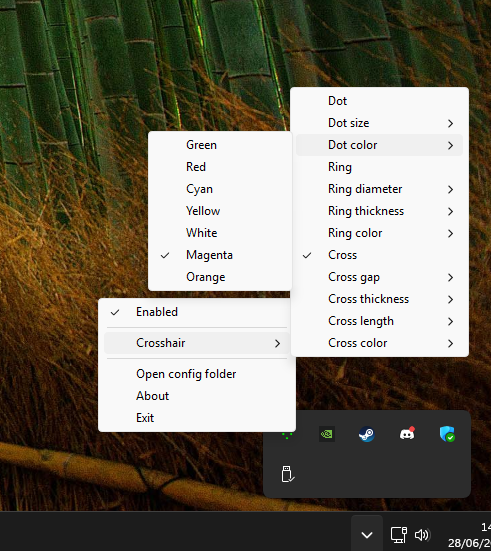

# simplecrosshair

Lightweight Windows crosshair overlay. System tray only — no main window, no extra dependencies.

Built with **Python + Win32 API (ctypes)** only. No PyQt, Tkinter, or Pygame.

## Download

Download the latest **`simplecrosshair.exe`** from the [**Releases**](https://github.com/adelasia/simplecrosshair/releases/latest) page.

No install required — run the `.exe` and look for the tray icon. Windows may show a SmartScreen warning for unsigned apps; choose **More info → Run anyway** if you trust the source.

## Features

- Transparent, click-through overlay (always on top)
- Hidden from Alt+Tab and the taskbar
- Global hotkey toggle (default: **F2**)
- Customizable crosshair from the tray menu:
  - **Dot** — on/off, size, color
  - **Ring** — on/off, diameter, thickness, color
  - **Cross** — on/off, gap, thickness, length, color
- Settings saved to `%APPDATA%\simplecrosshair\config.json`
- Low CPU and memory usage (~0% CPU when idle)

## Compatibility

Works on any application that's not fullscreen exclusive. You must use **windowed** or **borderless windowed** mode on your game. This was an intentional design choice, as rendering into a fullscreen-exclusive game is not anti-cheat-compatible.

## Usage

1. Run `simplecrosshair.exe` or `python main.py`
2. Find the green crosshair icon in the system tray
3. Press **F2** (or your configured hotkey) to show/hide the crosshair
4. Right-click the tray icon to change settings

> The crosshair starts **hidden** on launch. The on/off state is not saved between sessions.

### Start with Windows

To run simplecrosshair automatically when Windows starts:

1. Right-click `simplecrosshair.exe` and choose **Create shortcut**
2. Move the shortcut into the Startup folder:

```
C:\ProgramData\Microsoft\Windows\Start Menu\Programs\Startup
```

Paste that path into File Explorer's address bar, or press **Win + R**, type `shell:common startup`, and press Enter.

> This folder applies to **all users** and may require administrator permission to copy files into. For **your account only**, use `%APPDATA%\Microsoft\Windows\Start Menu\Programs\Startup` instead (Win + R → `shell:startup`).

The app will start in the tray on login. The crosshair itself still starts hidden until you press your hotkey.

## Screenshots




## Requirements

- Windows 10/11
- Python 3.11+ (only if running from source)

## Run from source

```bash
git clone https://github.com/adelasia/simplecrosshair.git
cd simplecrosshair
python main.py
```

## Build executable

```bash
pip install pyinstaller
python -m PyInstaller --onefile --noconsole --name simplecrosshair --icon resources/icon.ico --add-data "resources/icon.ico;resources" main.py
```

Output: `dist/simplecrosshair.exe`

## Configuration

Settings are stored at:

```
%APPDATA%\simplecrosshair\config.json
```

Example:

```json
{
  "hotkey": "F2",
  "crosshair": {
    "dot": { "enabled": true, "size": 2, "color": "#00FF00" },
    "ring": { "enabled": false, "diameter": 20, "thickness": 2, "color": "#00FF00" },
    "cross": { "enabled": true, "gap": 6, "thickness": 2, "length": 18, "color": "#00FF00" }
  }
}
```

Use **Open config folder** in the tray menu to edit the file directly.

## Feedback

If you have bugs to report, please let me know by [opening an issue](https://github.com/adelasia/simplecrosshair/issues).

For suggestions, questions, or even just to say hey, feel free to [start a discussion](https://github.com/adelasia/simplecrosshair/discussions).

## License

MIT — see [LICENSE](LICENSE).
